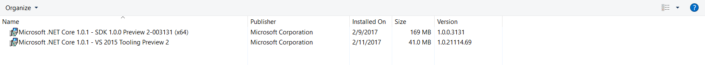
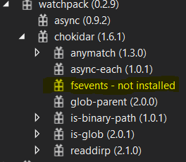
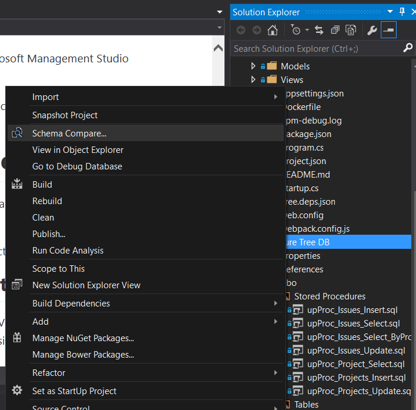
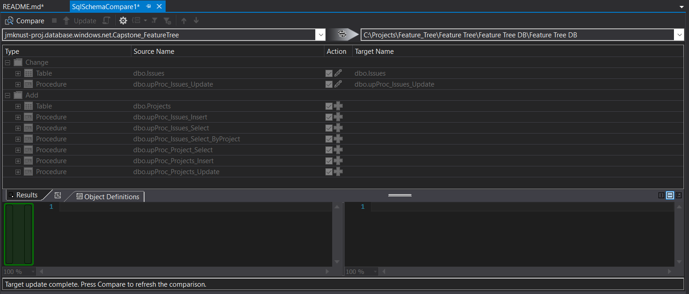

# BuilderTrend Feature Tree

## Project Dependencies
* .NET Core V1.0.1 SDK
* .NET Core V1.0.1 VS 2015 Tooling

* Node and NPM for Angular package management
* Typescript 2.0 (Will get errors 'required' error messages if not installed. Restart Visual Studio after install)

## Project Notes
* AppSettings.json
	* Contains Database Connection Settings. Must update to your localdb settings
* Package.json
    * Contains a list of all NPM packages that are used in the project. Pulls in all of the Angular Components.
    * You will most likely get a Dependencies - not installed message after restoring the NPM Packages.
        * This is caused by fsevents which will only install on Mac. It is an optional dependency so it does not matter.

* Project.json
    * The project.json file contains all the .net core project information as well as all of the nuget dependencies. If you had a package via nuget it will be displayed in this file.
* ClientApp
    * The Angular stuff goes here.

## SQL Source Control
Schema Changes (When connected to jmknust-proj.database.windows.net)
#### Scenerio 1 - Making a change in Microsoft Management Studio
1. Makes changes to Azure DB
2. Right click on DB Project and select 'Schema Compare'

3. Select the azure DB as your source and your local DB project as the target and run the comparison

4. It should display all of the changes you made.
5. Click on the Update button to Apply the schema changes to the Project files
#### Scenerio 2 - Making a change in visual studio and applying to Azure DB
1. Steps 1 & 2 above
2. Select the local DB Project as the source and Azure DB as target.
3. Steps 4 & 5 above

## API Routes Currently Working
* Issues: 
    * GET api/issues/\{Id}
* Users:
    * GET api/user/
    * GET api/user/851B90E1-36AD-4C73-ADC7-9C4A1745DA54
* Status:
    * GET api/status/
    * GET api/status/\{Id}

I gave up on Entity Framework for now. It just was not working. Now that I got stored procedure wired up it will be easy to wire up and create the rest.

# .NET Core Documentation

We've made some big updates in this release, so it’s **important** that you spend a few minutes to learn what’s new.

You've created a new ASP.NET Core project. [Learn what's new](https://go.microsoft.com/fwlink/?LinkId=518016)

## This application consists of:

*   Sample pages using ASP.NET Core MVC
*   [Gulp](https://go.microsoft.com/fwlink/?LinkId=518007) and [Bower](https://go.microsoft.com/fwlink/?LinkId=518004) for managing client-side libraries
*   Theming using [Bootstrap](https://go.microsoft.com/fwlink/?LinkID=398939)

## How to

*   [Add a Controller and View](https://go.microsoft.com/fwlink/?LinkID=398600)
*   [Add an appsetting in config and access it in app.](https://go.microsoft.com/fwlink/?LinkID=699562)
*   [Manage User Secrets using Secret Manager.](https://go.microsoft.com/fwlink/?LinkId=699315)
*   [Use logging to log a message.](https://go.microsoft.com/fwlink/?LinkId=699316)
*   [Add packages using NuGet.](https://go.microsoft.com/fwlink/?LinkId=699317)
*   [Add client packages using Bower.](https://go.microsoft.com/fwlink/?LinkId=699318)
*   [Target development, staging or production environment.](https://go.microsoft.com/fwlink/?LinkId=699319)

## Overview

*   [Conceptual overview of what is ASP.NET Core](https://go.microsoft.com/fwlink/?LinkId=518008)
*   [Fundamentals of ASP.NET Core such as Startup and middleware.](https://go.microsoft.com/fwlink/?LinkId=699320)
*   [Working with Data](https://go.microsoft.com/fwlink/?LinkId=398602)
*   [Security](https://go.microsoft.com/fwlink/?LinkId=398603)
*   [Client side development](https://go.microsoft.com/fwlink/?LinkID=699321)
*   [Develop on different platforms](https://go.microsoft.com/fwlink/?LinkID=699322)
*   [Read more on the documentation site](https://go.microsoft.com/fwlink/?LinkID=699323)

## Run & Deploy

*   [Run your app](https://go.microsoft.com/fwlink/?LinkID=517851)
*   [Run tools such as EF migrations and more](https://go.microsoft.com/fwlink/?LinkID=517853)
*   [Publish to Microsoft Azure Web Apps](https://go.microsoft.com/fwlink/?LinkID=398609)

We would love to hear your [feedback](https://go.microsoft.com/fwlink/?LinkId=518015)
